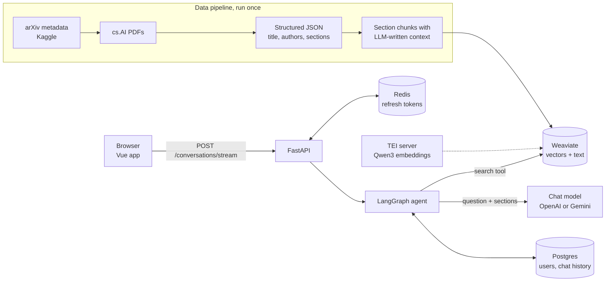

# arXiv RAG

Chat with research papers from arXiv's **cs.AI** category. Ask a question and the assistant searches a vector index
of about 24 thousand papers (over 400 thousand article sections), answers from the retrieved sections and lists the
arXiv ids it used as sources.

- Answers grounded in papers, with the arXiv ids of the sources
- Conversations with follow-up questions, saved per user
- Streaming answers, generated conversation titles
- Markdown, code highlighting and LaTeX math in answers
- Accounts with JWT access and refresh tokens
- Local embeddings on your own GPU, no embedding API needed
- Light and dark theme, works on phones

## How it works



**Indexing.** Every paper is split into its sections. Before a section is stored, an LLM writes a short summary
that places it in the context of the whole paper and that summary is prepended to the section, which makes sections
easier to find ([contextual retrieval](https://www.anthropic.com/news/contextual-retrieval)). The abstract is stored
as its own chunk. Each chunk is embedded with a local [Qwen3 embedding model](https://huggingface.co/Qwen/Qwen3-Embedding-0.6B)
and stored in Weaviate together with its source arXiv id, section title and authors.

**Answering.** A LangGraph graph gives the chat model a search tool. The model either answers directly or searches
first. A search embeds the query (with Qwen3's query instruction) and runs a hybrid vector + BM25 search over the
index, returning the 10 best sections. The model then answers from those sections and lists their arXiv ids.
Conversation history is stored by the LangGraph Postgres checkpointer, so follow-up questions keep their context.

**Search quality.** On 100 questions written by an LLM from random sections, the hybrid search returned the exact
source section first for 75% of them and in the top 10 for 98%, out of all ~415 thousand sections. Questions written
from a section are easier than real questions, so treat this as a sanity check, not a benchmark.

## Tech stack

| Part | Technology |
|---|---|
| Backend | Python 3.11, FastAPI, fully async |
| RAG | LangGraph 1.x, LangChain, OpenAI `gpt-5.4-mini` by default (Gemini optional) |
| Embeddings | Qwen3-Embedding-0.6B served by [text-embeddings-inference](https://github.com/huggingface/text-embeddings-inference) on an NVIDIA GPU |
| Vector database | Weaviate, hybrid search |
| Storage | Postgres (users, conversations, checkpoints), Redis (refresh tokens) |
| Frontend | Vue 3, Pinia, Vite, marked, KaTeX, Prism, DOMPurify |
| Packaging | uv, Docker, Traefik as reverse proxy in production |

## Requirements

- Docker with Compose (the commands use `docker compose`, the older `docker-compose` works too)
- An NVIDIA GPU with the [NVIDIA Container Toolkit](https://docs.nvidia.com/datacenter/cloud-native/container-toolkit/)
  for the embeddings server. The `86-*` image targets RTX 30xx (Ampere) cards; without a GPU use one of the `cpu-*`
  images of text-embeddings-inference, which is fine for answering queries but slow for embedding the whole dataset
- An OpenAI API key, or a Google AI Studio key with `LLM_PROVIDER="google"`
- For local development: [uv](https://docs.astral.sh/uv/) and Node.js 22

## Configuration

Copy `env_template` to `.env` and fill it in. Docker Compose and the app both read it.

| Variable | Description |
|---|---|
| `LLM_PROVIDER` | `openai` (default, model `gpt-5.4-mini`) or `google` |
| `OPENAI_API_KEY` | OpenAI key, needed with `LLM_PROVIDER="openai"` |
| `GOOGLE_API_KEY` | Google AI Studio key, needed with `LLM_PROVIDER="google"` |
| `JWT_SECRET` | Secret for signing tokens, use a long random string |
| `ALGORITHM` | JWT algorithm, `HS256` |
| `ACCESS_TOKEN_EXPIRE_MINUTES` | Access token lifetime; refresh tokens last 7 days |
| `PG_HOST`, `PG_USER`, `PG_PASS` | Postgres connection. The database is created by the postgres container |
| `PG_DB` | Optional database name, defaults to `PG_USER` |
| `REDIS_HOST` | Redis host |
| `WEAVIATE_HOST` | Weaviate host |
| `EMBEDDING_URL` | URL of the embeddings server |
| `EMBEDDING_MODEL` | Embedding model served by TEI, default `Qwen/Qwen3-Embedding-0.6B` |
| `VITE_API_BASE_URL` | Address the browser uses for the API, e.g. `http://localhost:8000` or `http://your-domain` |
| `HOST` | Production domain, used by Traefik |

Hosts depend on where the app runs: inside Docker (production compose) use the service names `postgres`, `redis`
and `weaviate`; when running the app on your machine (development) use `localhost` and
`EMBEDDING_URL="http://localhost:8081"`.

## Quick start with the prepared database

1. Clone the repository, create `.env` as described above and create the `backups` folder:
   ```bash
   mkdir backups
   ```
2. Download the [prepared Weaviate backup](https://drive.google.com/file/d/1s6dnBTHBjb7_J7L2qznFwjrp67ohcpLN/view?usp=drive_link)
   and unpack it into `backups`.
3. Start the services of the development compose file, which publishes their ports on your machine:
   ```bash
   docker compose up -d
   ```
4. Restore the backup into Weaviate:
   ```bash
   curl -X POST -H "Content-Type: application/json" -d '{"id": "arxiv-backup-v_1_0"}' \
     http://localhost:8080/v1/backups/filesystem/arxiv-backup-v_1_0/restore
   ```
5. The backup contains the `Arxiv` collection, embedded with a Google model that is no longer available.
   Re-embed it with the local model into the `ArxivQwen3` collection the app uses (see [Re-embedding](#re-embedding),
   about an hour on an RTX 3090):
   ```bash
   uv sync
   uv run python -m rag.reembed embed
   uv run python -m rag.reembed load
   ```
6. Stop the development services and start production, which builds the app image and puts it behind Traefik
   on port 80. Both compose files use the same data volumes:
   ```bash
   docker compose down
   docker compose -f docker-compose-prod.yml up --build -d
   ```
7. Open `http://localhost` (or your `HOST`) and register an account.

## Local development

Start the services (Weaviate, embeddings server, Postgres, Redis and Adminer):

```bash
docker compose up -d
```

| Service | Port |
|---|---|
| Weaviate | 8080 (HTTP), 50051 (gRPC) |
| Embeddings (TEI) | 8081 |
| Postgres | 5432 |
| Redis | 6379 |
| Adminer | 8880 |

Build the frontend once, the API serves it from `rag/web/arxiv_ai_chat/dist` and does not start without it:

```bash
cd rag/web/arxiv_ai_chat
npm ci
npm run build
cd ../../..
```

Run the API at `http://localhost:8000`, the interactive API docs are at `/docs`:

```bash
uv sync
uv run uvicorn rag.api.api:app --port 8000
```

For frontend work with hot reload run `npm run dev` in `rag/web/arxiv_ai_chat` and open `http://localhost:5173`;
it talks to the API at `VITE_API_BASE_URL`.

## Building the dataset

The prepared backup already contains indexed papers. To collect and index papers yourself:

1. **Pick papers.** `scripts/all_cs_ai_files.py` reads the
   [arXiv metadata from Kaggle](https://www.kaggle.com/datasets/Cornell-University/arxiv) and lists the newest
   version of cs.AI papers that are not downloaded yet. It currently keeps only 2025 papers (ids starting with
   `25`), change that filter to collect other years.
2. **Download PDFs.** `scripts/download_pdfs.sh` copies them from arXiv's public Google Cloud bucket with `gsutil`.
3. **Convert to JSON.** `scripts/gemini.py` turns each PDF into JSON with the title, authors, abstract and sections,
   with equations as LaTeX, using Gemini (or Mistral OCR). It reads its keys from `GEMINI_API_KEY` and
   `MISTRAL_API_KEY`, and the results go to `json_gemini/`. The Gemini model named in the script has since been
   retired, update it before running the script.
4. **Index.** Builds the chunks with their context summaries, embeds them and stores them in the collection set by
   `collection` in `rag/settings.py`. Papers that are already indexed are skipped, so the step can be rerun:
   ```bash
   uv run python -m rag.indexing
   ```
   It calls the chat model once per section, which costs time and API credits for a large dataset.

## Re-embedding

`rag/reembed.py` recomputes the vectors of an existing collection with the local model, without rerunning the
expensive context summaries. It works in resumable steps:

```bash
uv run python -m rag.reembed bench --limit 2000   # optional: measure throughput, saves nothing
uv run python -m rag.reembed embed                # read Arxiv, embed, save shards to ./embeddings
uv run python -m rag.reembed load                 # create ArxivQwen3 and insert the shards
```

`embed` saves the chunks and vectors in shards of 10,000 under `./embeddings/<model>/`; if it stops, running it
again continues after the last complete shard. The shards are a full copy of the index, so `load` can rebuild the
collection at any time without embedding again. Use `--source` and `--target` to choose other collections, and set
`EMBEDDING_MODEL` (for the TEI service as well) to use another model.

## Backups

Create a backup of a Weaviate collection in `backups/`:

```bash
curl -X POST -H "Content-Type: application/json" -d '{"id": "arxiv-qwen3-v1", "include": ["ArxivQwen3"]}' \
  http://localhost:8080/v1/backups/filesystem
```

Restore it on another machine with the restore command from the quick start and the new id. A backup of
`ArxivQwen3` needs no re-embedding, as long as the same embedding model is served.

## API

| Method | Path | Description |
|---|---|---|
| POST | `/register` | Create an account |
| POST | `/token` | Log in, returns access and refresh tokens |
| POST | `/refresh` | Exchange a refresh token for new tokens |
| POST | `/logout`, `/logout-all` | Revoke tokens of this session or of all sessions |
| GET | `/users/me` | Current user |
| GET | `/conversations?limit=&offset=` | Conversations of the user, newest first |
| GET | `/conversations/count` | Number of conversations |
| POST | `/conversations/stream` | Send `{"query", "thread_id"}` and stream the answer as server-sent events; without `thread_id` a new conversation is started |
| GET | `/conversations/{thread_id}/messages` | Messages of a conversation |
| PUT | `/conversations/{thread_id}?title=` | Rename a conversation |
| DELETE | `/conversations/{thread_id}` | Delete a conversation and its history |

## Project structure

```
rag/
├── api/
│   ├── api.py            FastAPI app, routes and answer streaming
│   ├── models.py         request and response models
│   └── utils.py          auth, tokens and conversation queries
├── db/
│   ├── db.py             Weaviate connection and collection schema
│   └── db_objects.py     SQLAlchemy models: users, logins, conversations
├── rag_pipeline.py       LangGraph graph: search tool, answering, titles
├── embeddings.py         client for the TEI embeddings server
├── indexing.py           builds and stores chunks from json_gemini/
├── reembed.py            re-embeds an existing collection
├── settings.py           settings read from the environment and .env
├── utils.py              chat model and embeddings factories
└── web/arxiv_ai_chat/    Vue frontend
scripts/                  dataset collection: paper list, PDF download, PDF to JSON
docker-compose.yml        development services
docker-compose-prod.yml   production stack with Traefik and the app
```
